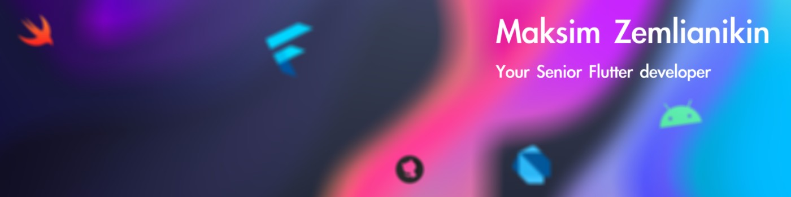

<!--  -->

# Hi there, I'm Maksim 👋

I'm a senior developer with a passion for creating high-quality software. I specialize in:
- 📱 **Flutter**: I build mobile, desktop, and web apps of any complexity.
- 🌐 **Backend Development**: Skilled in shelf, gRPC, PostgreSQL, and Docker.

I believe programming is an art, and I enjoy finding elegant solutions to complex problems.
I also love sharing knowledge and organizing IT events to bring the community together.

